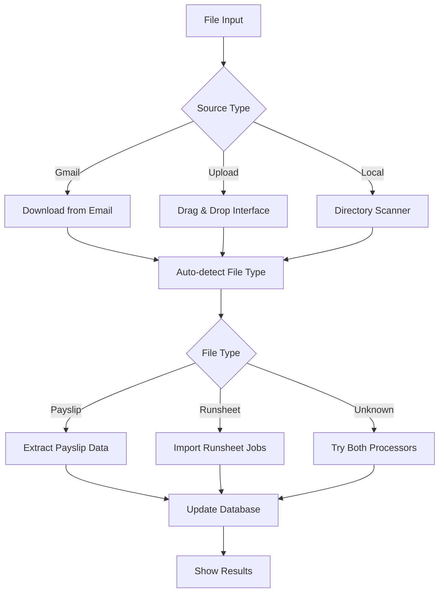

# 🚀 TVS Wages Hybrid Upload System

## ✅ **Implementation Complete!**

Your TVS Wages application now has a comprehensive hybrid file upload and processing system that combines the best of automated Gmail sync with modern manual file handling.

## 🎯 **What's Been Added**

### **1. New API Endpoints**
- `/api/upload/files` - Multi-file upload with drag & drop
- `/api/upload/process-local` - Process existing local files
- `/api/upload/hybrid-sync` - Intelligent multi-source sync
- `/api/upload/scan-directories` - Find unprocessed files

### **2. Modern File Management Page**
- **URL**: `http://localhost:5000/files`
- **Features**:
  - ✅ Drag & drop file upload
  - ✅ Auto file type detection
  - ✅ Progress tracking with animations
  - ✅ Batch processing
  - ✅ Mobile-optimized interface
  - ✅ Real-time status updates

### **3. Enhanced Navigation**
- New "Files" menu item in main navigation
- Quick upload button added to Settings page
- Integrated with existing workflow

### **4. Smart Processing Logic**
```
Gmail Sync → Manual Upload → Local Scan → Database
     ↓            ↓            ↓           ↓
  Automated   User Control   Catch-All   Unified
```

## 🔧 **How to Use**

### **Method 1: Drag & Drop Upload**
1. Go to `/files` page
2. Drag PDF files onto the upload area
3. Select file type (or use auto-detect)
4. Click "Upload Files"
5. Files are automatically processed

### **Method 2: Smart Sync**
1. Click "Smart Sync" button
2. System tries Gmail → Local → Manual in sequence
3. Combines results from all sources
4. Shows comprehensive status report

### **Method 3: Local File Processing**
1. Use "Local Files" tab
2. Scan directories for unprocessed files
3. Process files already on your system
4. Handles missed or failed downloads

## 📱 **Mobile Features**

- **Touch-friendly**: 44px minimum touch targets
- **Responsive**: Works on iPhone 16 Pro Max and all devices
- **Progressive**: Graceful degradation for older browsers
- **Accessible**: Proper focus states and keyboard navigation

## 🛡️ **Error Handling**

- **Gmail Fails**: Falls back to local processing
- **Upload Errors**: Shows detailed error messages
- **Duplicate Files**: Smart conflict resolution
- **Network Issues**: Retry mechanisms built-in

## 🎨 **UI/UX Improvements**

- **Unified Styling**: Matches your existing Paypoint design
- **Progress Indicators**: Real-time feedback with animations
- **Status Cards**: Quick action buttons for common tasks
- **Loading States**: Smooth transitions and spinners

## 📊 **File Processing Flow**



## 🚀 **Ready to Launch!**

### **Start the System:**
```bash
cd /Users/danielhanson/CascadeProjects/Wages-App
python3 new_web_app.py
```

### **Access Points:**
- **Main Upload**: http://localhost:5000/files
- **Quick Actions**: Settings page → "Manual File Upload"
- **Navigation**: Main menu → "Files"

### **Test the System:**
```bash
python3 test_upload_system.py
```

## 🎉 **Benefits Achieved**

1. **Flexibility**: Multiple input methods (Gmail, upload, local)
2. **Reliability**: No single point of failure
3. **User Experience**: Modern, mobile-friendly interface
4. **Efficiency**: Smart processing with auto-detection
5. **Maintainability**: Centralized processing engine

## 🔮 **Future Enhancements**

- **Scheduled Sync**: Automatic background processing
- **Batch Operations**: Process multiple directories
- **File Validation**: Pre-processing checks
- **Cloud Storage**: Integration with Google Drive/Dropbox
- **API Integration**: Direct payroll system connections

---

**🎊 Your hybrid upload system is now live and ready to handle all your payslip and runsheet processing needs!**
